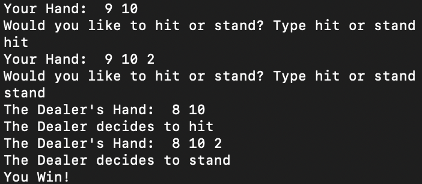
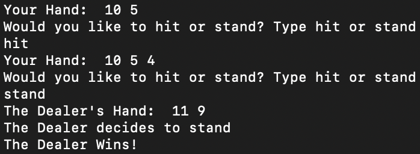

# Blackjack
Blackjack Game implementation in the terminal.

Examples:




To play the computer, run in terminal:

```
git clone https://github.com/JunnanShimizu/Blackjack.git
```
```
cd Blackjack
```
```
javac Play.java
```
```
java Play.java
```
Note: To run a simulation of 1000 Blackjack games for statistical purposes, run: `java Simulation.java`
